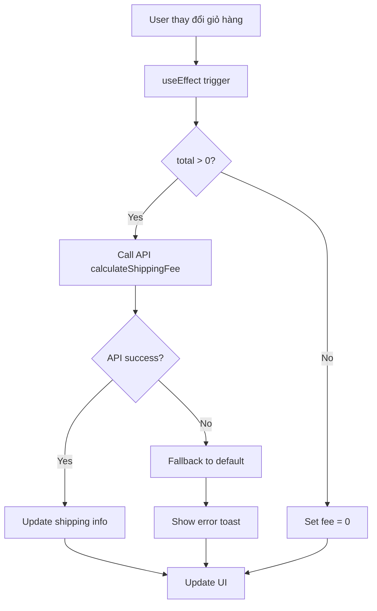

# Tích hợp tính năng tính phí ship vào CartSummary

## Tổng quan

Tính năng tính phí ship đã được tích hợp thành công vào component `CartSummary.tsx`, cho phép tính toán phí vận chuyển động dựa trên cấu hình admin và giá trị đơn hàng.

## Các thay đổi chính

### 1. CartSummary Component (`client/src/pages/public/cart/components/CartSummary.tsx`)

**Tính năng mới:**
- ✅ **Real-time calculation**: Tự động tính phí ship khi giá trị giỏ hàng thay đổi
- ✅ **API Integration**: Sử dụng `shipService.calculateShippingFee()` để gọi backend
- ✅ **Loading states**: Hiển thị loading spinner khi đang tính phí
- ✅ **Error handling**: Fallback về phí mặc định nếu API lỗi
- ✅ **Smart UI**: Hiển thị thông báo miễn phí ship và gợi ý thêm sản phẩm
- ✅ **Currency formatting**: Format VNĐ chuẩn Việt Nam

**Thay thế logic cũ:**
- ❌ Hardcode phí ship 30,000 VNĐ
- ❌ Hardcode ngưỡng miễn phí 2,000,000 VNĐ
- ✅ Dynamic calculation từ backend API

### 2. ShippingInfo Interface

```typescript
interface ShippingInfo {
    fee: number                    // Phí ship tính được
    freeShippingThreshold: number  // Ngưỡng miễn phí từ API
    isFreeShipping: boolean        // Có được miễn phí không
    isLoading: boolean            // Trạng thái loading
    error: string | null          // Lỗi nếu có
}
```

### 3. Demo Component (`client/src/pages/public/cart/components/ShippingCalculatorDemo.tsx`)

Component demo để test tính năng tính phí ship độc lập, hữu ích cho:
- Testing API integration
- Debugging shipping calculation
- Demo cho stakeholders

## Cách hoạt động

### 1. Flow tính phí ship



### 2. Error Handling Strategy

1. **API Error**: Fallback về phí mặc định (30,000 VNĐ cho đơn < 500,000 VNĐ)
2. **Network Error**: Hiển thị toast warning, không block user experience
3. **Invalid Response**: Log error, sử dụng fallback values
4. **Empty Cart**: Set phí = 0, không gọi API

### 3. UI States

**Loading State:**
```jsx
<div className="flex items-center gap-2">
    <Loader2 className="w-4 h-4 animate-spin" />
    Đang tính phí ship...
</div>
```

**Free Shipping:**
```jsx
<div className="bg-green-50 border border-green-200 rounded-lg">
    🎉 Miễn phí giao hàng
</div>
```

**Paid Shipping:**
```jsx
<div className="bg-blue-50 p-2 rounded">
    💡 Miễn phí ship cho đơn hàng từ {threshold}
    Thêm {amount} để được miễn phí ship
</div>
```

**Error State:**
```jsx
<div className="text-amber-600">
    <AlertCircle className="w-4 h-4" />
    Không thể tải thông tin phí ship. Sử dụng mức phí mặc định.
</div>
```

## API Integration

### Endpoint sử dụng
```
POST /api/v1/ship/calculate-fee
```

### Request
```json
{
    "orderValue": 300000
}
```

### Response
```json
{
    "success": true,
    "message": "Calculated shipping fee successfully",
    "data": {
        "orderValue": 300000,
        "shippingFee": 30000,
        "freeShippingThreshold": 500000,
        "isFreeShipping": false,
        "totalAmount": 330000
    }
}
```

## Performance Considerations

### 1. Debouncing
- API chỉ được gọi khi `total` thay đổi
- useEffect dependency: `[total]`
- Không cần debounce vì cart total ít khi thay đổi liên tục

### 2. Caching
- Có thể implement caching cho cùng order value
- Hiện tại chưa cần thiết vì API response nhanh

### 3. Error Recovery
- Fallback values đảm bảo user experience không bị gián đoạn
- Toast notification không invasive

## Testing

### 1. Manual Testing
```bash
# Sử dụng ShippingCalculatorDemo component
# Test các case:
- Đơn hàng < ngưỡng miễn phí
- Đơn hàng >= ngưỡng miễn phí  
- API error scenarios
- Loading states
```

### 2. Integration Testing
```bash
# Test trong CartSummary:
- Thêm/xóa sản phẩm khỏi giỏ hàng
- Thay đổi số lượng sản phẩm
- Kiểm tra tổng tiền cuối cùng
- Test responsive design
```

## Troubleshooting

### 1. API không hoạt động
**Triệu chứng:** Luôn hiển thị phí mặc định
**Giải pháp:** 
- Kiểm tra backend server đang chạy
- Kiểm tra có cấu hình ship active trong admin
- Check network tab trong DevTools

### 2. Loading không kết thúc
**Triệu chứng:** Spinner quay mãi không dừng
**Giải pháp:**
- Check console errors
- Verify API endpoint URL
- Kiểm tra CORS settings

### 3. Phí ship không chính xác
**Triệu chứng:** Phí tính sai so với cấu hình admin
**Giải pháp:**
- Kiểm tra cấu hình ship trong admin panel
- Verify order value được truyền đúng
- Check API response trong Network tab

## Future Enhancements

### 1. Caching Strategy
- Implement React Query hoặc SWR
- Cache shipping configs
- Invalidate cache khi admin thay đổi config

### 2. Advanced Features
- Multiple shipping methods
- Location-based shipping
- Weight-based calculation
- Shipping time estimates

### 3. Performance Optimization
- Debounce API calls
- Preload shipping configs
- Optimize re-renders

## Kết luận

Tính năng tính phí ship đã được tích hợp thành công với:
- ✅ Real-time calculation
- ✅ Error handling robust
- ✅ User experience tốt
- ✅ Responsive design
- ✅ Vietnamese localization
- ✅ Fallback mechanisms

Tính năng sẵn sàng cho production và có thể mở rộng dễ dàng trong tương lai.
